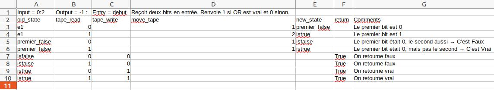

# auturing

A simple turing machine in python3

# Requirements

- Python 3
- Pip

# Installation

```console
user@computer:$ git clone https://github.com/GDelevoye/auturing
user@computer:$ pip install -e ./auturing
```

# Usage

## Create a new program

- To be executable, the program must be a .csv file located in **auturing/resources/programs**
- The .csv files must be **tab-separated**
- **The first line is the header and must be either ignored (skipped) or parsed by the calling program**

For now there are two examples (that work). See them to understand the formatting - it's pretty straightforward



## Execute a program


```console
user@computer:~$ auturing --help
usage: auturing [-h] [--tape TAPE] [--begin_state BEGIN_STATE] [--head_position HEAD_POSITION] [--return_begin RETURN_BEGIN] [--return_end RETURN_END] [--max_steps MAX_STEPS] [--verbosity {DEBUG,INFO,WARNING,ERROR,CRITICAL}] [--progress_bar] program_name

positional arguments:
  program_name

optional arguments:
  -h, --help            show this help message and exit
  --tape TAPE, -t TAPE  Input tape (comma-separated values) <DEFAULT:0>
  --begin_state BEGIN_STATE, -b BEGIN_STATE
                        Begin state of the program <DEFAULT: "e1">
  --head_position HEAD_POSITION
                        Head position on the tape at start <DEFAULT:0>
  --return_begin RETURN_BEGIN
                        Indice starting from which the tape should be returned <DEFAULT: 0>
  --return_end RETURN_END
                        Indice until which the tape should be returned <DEFAULT: end>
  --max_steps MAX_STEPS
                        Max number of steps in the algotithm <DEFAULT: np.inf>
  --verbosity {DEBUG,INFO,WARNING,ERROR,CRITICAL}, -v {DEBUG,INFO,WARNING,ERROR,CRITICAL}
                        Choose your verbosity. Default: INFO
```

### Example : Function OR

This program (OR.csv) takes two bits of input, returns 0 if both of them are 0 and return 1 if any of them is true.

When can return the whole band as a result :

```console
(base) user@computer:~$ auturing OR.csv --tape 1,0
[0, 0, 1]
(base) user@computer:~$ auturing OR.csv --tape 0,1
[0, 0, 1]
(base) user@computer:~$ auturing OR.csv --tape 0,0
[0, 0, 0]
(base) user@computer:~$ auturing OR.csv --tape 1,1
[0, 1, 1]
```

Or restrict only the output to the result bit :

```console
(base) user@computer:~$ auturing OR.csv --tape 1,0 --return_begin 2
[1]
(base) user@computer:~$ auturing OR.csv --tape 0,1 --return_begin 2
[1]
(base) user@computer:~$ auturing OR.csv --tape 0,0 --return_begin 2
[0]
(base) user@computer:~$ auturing OR.csv --tape 1,1 --return_begin 2
[1]
```

It's also possible to use negative indexed. This can serve to get only the last bit for instance:

```console
(base) user@computer:~$ auturing OR.csv --tape 1,1 --return_begin -1
[1]
```

# Credits

DELEVOYE Guillaume - 2021
delevoye.guillaume@gmail.com

# License

See "LICENSE.txt" for more infos
